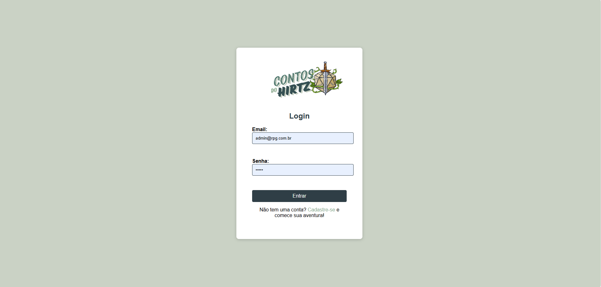
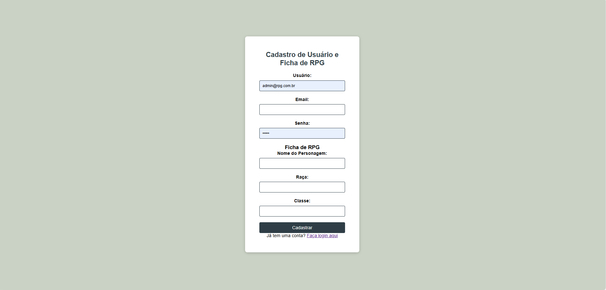
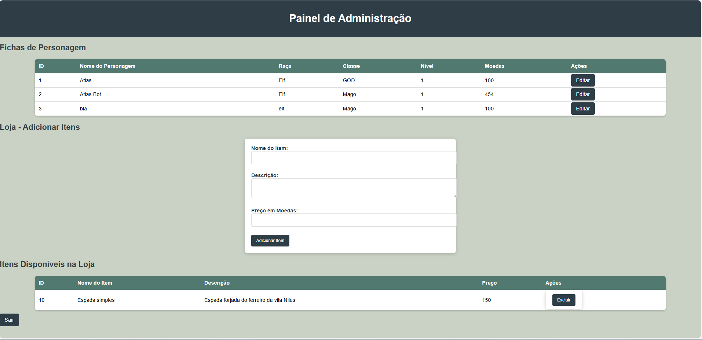
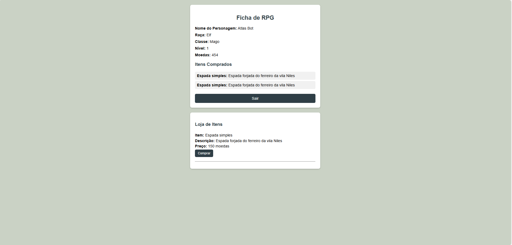

# Contos do Hirtz - Gerenciador de Ficha de RPG

Este é um sistema web completo para gestão de fichas de RPG, onde jogadores podem criar e visualizar personagens enquanto administradores podem gerenciar fichas, moedas e itens da loja no painel de administração.

## 📝 Índice

- [Visão Geral](#visão-geral)
- [Funcionalidades](#funcionalidades)
- [Estrutura do Projeto](#estrutura-do-projeto)


---

## Visão Geral

Este projeto foi desenvolvido para facilitar a criação e o gerenciamento de fichas de RPG. Ele permite que:
- Jogadores se cadastrem e criem automaticamente uma ficha de personagem.
- Administradores possam acessar um painel completo para gerenciar personagens, moedas e itens da loja.

O sistema é desenvolvido em **PHP** com **MySQL** para o banco de dados, e está pronto para rodar em qualquer ambiente LAMP (Linux, Apache, MySQL, PHP).

## Funcionalidades

- **Cadastro e Login de Usuário**: Interface amigável para que novos jogadores se cadastrem no sistema.
- **Criação Automática de Ficha**: Ao se cadastrar, cada usuário recebe uma ficha de personagem com valores padrão (raça, classe, moedas, etc).
- **Painel de Administração**:
  - **Gestão de Fichas**: Permite a visualização e edição das fichas dos jogadores, incluindo controle de moedas.
  - **Gestão de Loja**: Administradores podem adicionar ou remover itens que os jogadores podem comprar usando moedas de jogo.
- **Sistema de Login e Logout**: Segurança no acesso, limitando o painel de administração a usuários autorizados.
  # RPG Character Sheet Management System

Uma visualização das principais telas do sistema:

## Página de Login


## Página de Registro


## Painel de Administração


## Página da Ficha


## Estrutura do Projeto

```plaintext
rpg-website/
│
├── src/
│   ├── admin.css            # Estilos para o painel de administração
│   ├── login.css            # Estilos para a página de login
│   ├── register2.css        # Estilos para a página de cadastro
│   ├── edit_ficha2.css      # Estilos para a página de editar ficha
│   ├── ficha2.css           # Estilos para a página de ficha
│
├── login.php               # Página de login
├── register.php            # Página de cadastro de usuário e criação de ficha
├── ficha.php               # Exibição da ficha do personagem
├── edit_ficha.php          # Edição da ficha
├── admin.php               # Painel de administração
├── logout.php              # Logout do usuário
├── README.md               # Documentação do projeto

